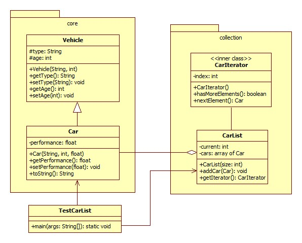

# LABOR 2

    Oláh Tamás-Lajos
    otim1750
    523 / 2

## FELADAT

Az alábbi osztálydiagram alapján hozzuk létre a diagramban feltüntetett csomagokat és osztályokat.

### MAGYARÁZAT
Létrehozzuk a `core` és `collection` csomagokat.
A `core` csomagon belül létrehozunk egy __jármű__ (`Vehicle`) osztályt (`POJO`) a __típus__ (`type`) és __kor__ (`age`) adattagokkal, az adattagok értékeit beállító __paraméteres konstruktorral__, valamint az adattagoknak megfelelő `getter` és `setter` metódusokkal. A `Vehicle` osztályból __származtatjuk__ az __autó__ (`Car`) osztályt, kiegészítve a __teljesítmény__ (`performance`) adattaggal, a megfelelő __konstruktorral__ és `getter` / `setter` metódusokkal. A `Car` osztályon belül __újradefiniáljuk__ az `Object` ősosztály `toString` metódusát, __visszatérítve__ az autókkal kapcsolatos __információk szöveges reprezentációját__ ( például a __típus__, __kor__ és __teljesítmény__ tulajdonságoknak megfelelő stringek __összefűzéséből előállított stringet__ ).

A `collection` csomagon __belül__ létrehozzuk a `CarList` osztályt, amelyből autó objektumokat tartalmazó __gyűjtemények példányosíthatóak__. Az osztályon belül egy `Car` típusú elemeket tartalmazó __tömbben__ rögzítjük a autókkal kapcsolatos információkat. A `current` adattag mindig __a tömb aktuális elemére__ fog mutatni, így az új autó beillesztését végző `addCar` metódus felhasználhatja ezt az értéket az új elem pozíciójának meghatározásához, és a beillesztés után elvégezheti az érték frissítését. A __tömb méretét__ (a lista maximális kapacitását) a __konstruktor paramétere__ határozza meg, __az elemeknek a konstruktoron belül foglalunk helyet__.

A lista bejárása egy __iterátor__ segítségével történhet, a `CarIterator` osztály által. Az osztály két metódust tartalmaz: a `hasMoreElements` metódus segítségével __lekérdezhető__, hogy __van-e még elem a listában__ (vagy annak végéhez értünk), a `nextElement` metódus segítségével __lekérdezhető a lista következő eleme__. Ugyanakkor az osztályban egy __egész típusú attribútum segítségével történik az aktuális  pozíció rögzítése__. Az osztályt a `CarList` osztály __belső osztályaként__ hozzuk létre, és a `CarList` osztály `getIterator()` metódusa segítségével példányosíthatjuk.

A létrehozott osztályok kipróbálásához __írjunk egy rövid programot__. A `TestCarList` osztály `main` metódusán belül hozzunk létre néhány `Car` objektumot. Hozzunk létre egy __listát__ (`CarList` példány), és __adjuk hozzá ehhez a létrehozott autó objektumokat__. Az __iterátor segítségével__ __egy cikluson belül járjuk be a listát__, és __írjuk ki a konzolra az autókkal kapcsolatos információkat__.