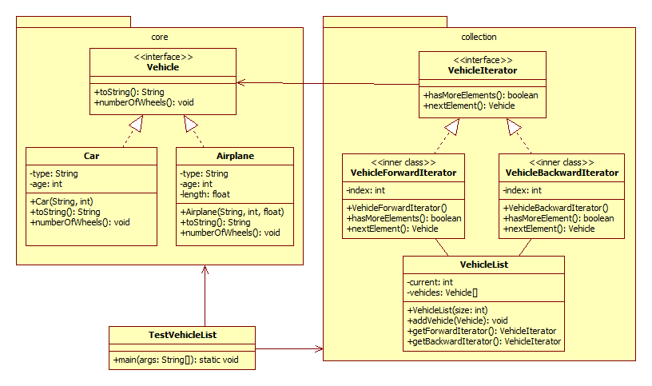

# 3. Laboratóriumi gyakorlat

	Oláh Tamás-Lajos
	otim1750
	523 / 2

Az alábbi osztálydiagram alapján hozzuk létre a diagramban feltüntetett csomagokat és osztályokat.

**Magyarázat**: létrehozzuk a **core** és **collection** csomagokat. A **core** csomagon belül létrehozunk egy **jármű** (`Vehicle`) *interfészt* a `toString()` és a **kerekekSzáma** (`numberOfWheels()`) metódusokkal. A `Vehicle` interfészt az **autó** (`Car`) és **repülőgép** (`Airplane`) osztályok *implementálják*. Az **autó** osztály a **típus** (`type`) és **kor** (`age`) adattagokkal rendelkezik, a **repülőgép** osztálynak *ezen kívül* még egy **hossz** (`lenght`) adattagja is van.

A `toString()` metódus az `Object` *ősosztály* **újradefiniált változata**, és **visszatéríti a járművekkel kapcsolatos információk szöveges reprezentációját** (*például, a **repülőgépek** esetében a **típus**, **kor** és **hossz** tulajdonságoknak megfelelő stringek **összefűzéséből** előállított **stringet***). A `numberOfWheels()` függvény mindkét osztály esetében **kiírja, hogy az adott járműnek hány kereke van** (*például: `"The car has 4 wheels"`*).

A **collection** csomagon belül létrehozzuk az `VehicleList` osztályt, amelyből **jármű objektumokat tartalmazó gyűjteméanyek példányosíthatóak**. Az osztályon belül egy `Jármű` típusú elemeket tartalmazó **tömbben** rögzítjük a **járművekkel kapcsolatos információkat**. A `current` adattag mindig **a tömb aktuális elemére fog mutatni**, így az új jármű beillesztését végző `addVehicle` metódus **felhasználhatja ezt az értéket** *az új elem pozíciójának meghatározásához*, *és a beillesztés után elvégezheti az érték frissítését*. A **tömb méretét** (*a lista maximális kapacitását*) a **konstruktor paramétere határozza meg**, **az elemeknek a konstruktoron belül foglalunk helyet**.

**A lista bejárása két iterátor segítségével történhet**, a `VehicleForwardterator`, illetve a `VehicleBackwardIterator` osztályok által, amelyek a maguk módján a `VehicleIterator` *interfészt* implementálják. Az interfész **két metódust tartalmaz**: a `hasMoreElements` metódus segítségével **lekérdezhető, hogy van-e még elem a listában** (vagy annak végéhez/elejéhez értünk), a `nextElement` metódus segítségével **lekérdezhető a lista következő eleme**. Ahogy a nevük is jelzi, a `VehicleForwardterator` a **lista első elemétől halad az utolsó fele**, míg a `VehicleBackwardIterator` **fordított irányban**. **Az iterátor osztályokban egy egész típusú attribútum segítségével történik az aktuális pozíció rögzítése**. Az osztályokat a `VehicleList` osztály *belső osztályaként* hozzuk létre, és a `VehicleList` osztály `getForwardIterator()`, illetve `getBackwardIterator()` metódusai segítségével **példányosíthatjuk**.

A létrehozott osztályok kipróbálásához **írjunk egy rövid programot**. A `TestVehicleListosztály` `main` metódusán belül hozzunk létre egy “*autó és replő gyűjteményt*”, azaz **néhány `Car` és `Airplane` objektumot**, majd hozzunk létre **egy listát** (*`VehicleList` példány*), és **adjuk hozzá ehhez a létrehozott jármű objektumokat**. Az *iterátorok segítségével* **egy-egy cikluson belül** *járjuk be a “gyűjteményt”, **mindkét irányban**, és írjuk ki a konzolra a **járművekkel kapcsolatos információkat**, illetve azt, hogy **hány kerekük van**.*
