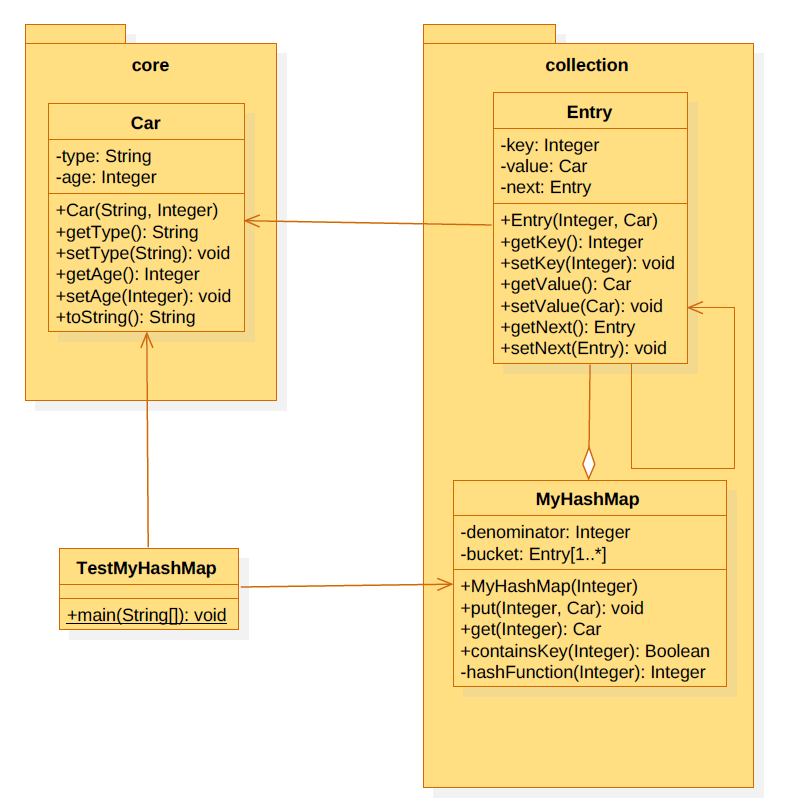

# 4. Laborgyakorlat

Feladatunk az, hogy **tároljunk autókat** úgy, hogy a későbbiek során tudjunk *hatékonyan rákeresni egy adott autóra* az **alvázszáma** alapján. (Az egyszerűség kedvéért **az alvázszám egy négyjegyű, egyedi szám**).

Az alábbi osztálydiagram segítségünkre lesz létrehozni a szükséges csomagokat és osztályokat:



Minden **autó** (`Car`) esetén tároljuk az autó **típusát** (`type`), az autó **korát** (`age`); tovabbá, felülírjuk a `toString()` metódust, úgy hogy az az autó adatainak az **összefűzését** térítse vissza.

Láthatjuk, hogy az egyes autók az alvázszámaikkal **kulcs-érték** (`key-value`) **párokat** fognak alkotni. Úgy szeretnénk eltárolni ezeket a kulcs-értek párokat, hogy **hatékonyan tudjunk majd keresni a kulcs alapján**. Ennek érdekében egy **asszociatív tömböt** (`map`) fogunk használni, pontosabban egy **`hash map`**-et.

Célunk az, hogy **különböző csoportokba** (`bucket`) **osszuk szét** az autókat. Azt, hogy melyik autó melyik csoportba fog kerülni, a **hash függvény** fogja meghatározni. Ha gondosan választjuk meg a hash függvényt és sikerül egyenletesen elosztani az autókat, akkor keresés esetén az összes autó helyett elegendő csak egy adott csoportban lévő autókat leellenőrizni.

Minden egyes csoporton belül egy **láncolt listát** fogunk felépíteni. Ennek érdekében hozzunk létre egy `Entry` osztályt, amelyben tárolunk egy **kulcsot** (*alvázszám*), a **hozzá tartozó autót** és a *láncolást megvalósító*, **következő elemre mutató `next` tagot**.

Végül hozzuk létre magát a `MyHashMap` osztályt. A hash függvénynek **a maradékos osztást választjuk**. Annak függvényében, hogy mivel osztunk (`denominator`), annyi különböző csoportba kerülnek az autók. Ez azt jelenti, hogy szükségünk van egy `Entry` típusú elemeket tároló **tömbre**, amelynek **pontosan annyi eleme van, amennyi az osztó értéke**.

Lehetőséget kell biztosítsunk egy **új autó beszúrására**:

```java
public void put(int key, Car value)
```

A **hash függvénynek megadott** kulcs határozza meg, hogy **melyik csoportba kell beszúrni az autót**. Ha az adott csoport **üres**, akkor **betesszük az új autót**, **ha nem**, akkor **egyszerűen hozzáfűzzük a lista elejére**. Továbbá, **le kell tudjunk kérni egy autót a kulcsa alapján**:

```java
public Car get(int key)
```

Ha egy **nem létező kulcsra keresünk rá**, akkor a **visszatérítési érték null**. Végül, fontos, hogy a felhasznaló **le tudja tesztelni**, hogy **egy kulcs létezik-e vagy sem**:

```java
public boolean containsKey(int key)).
```

Annak érdekében, hogy *le tudjuk tesztelni az általunk implementált hash map-et*, hozzunk létre egy `TestMyHashMap` osztályt, itt **példányosítsunk néhany `Car` objektumot**. **Adjuk hozzá ezeket az autókat** a `hash map`-hez **alvázszámaikkal együtt**. Ezután **keressünk rá egy autóra** *az alvázszám alapjan* úgy, hogy **előtte teszteljük le, hogy az adott szám (*kulcs*) létezik-e**.

**Fontos:** teszteljük úgy a `hash map`-et, hogy **minimum 3 autó kerüljön ugyanabba a csoportba**, majd **kérdezzük le**, hogy a `hash map` **tartalmazza-e ezeket az elemeket**, illetve **kérdezzünk rá nem létező elemre is**, pl:

```java
Car car1 = new Car("Toyota",10);
Car car2 = new Car("Suzuki", 9);
Car car3 = new Car("Mitsubishi",3);
Car car4 = new Car("Nissan", 6);

MyHashMap uj = new MyHashMap(3);
uj.put(1406,car1);
uj.put(2012,car2);
uj.put(3013,car3);
uj.put(8493,car4);

System.out.println(uj.get(1406));
System.out.println(uj.get(8493));
System.out.println(uj.get(3013));
System.out.println(uj.get(2012));
System.out.println(uj.get(1340));  // nem létező elem lekérdezése; null-ot kell visszatérítsen

System.out.println(uj.containsKey(3013));
System.out.println(uj.containsKey(1340));
```