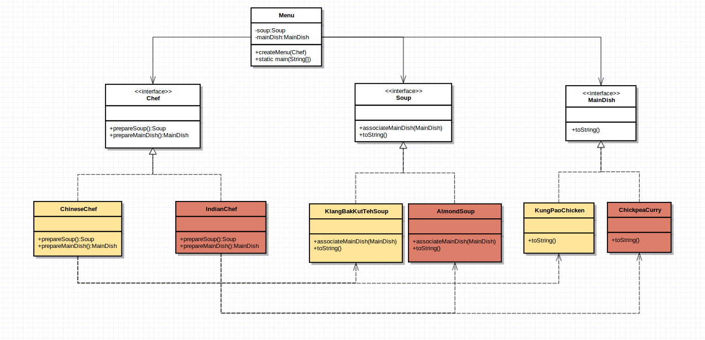

# 7. Laboratóriumi gyakorlat
Alkalmazzuk az elvont gyár tervezési mintát az alábbi ábra alapján:

Hozzunk létre egy szakács (Chef) interfészt, amely két metódust tartalmaz, az egyik metódus a leves elkészítését valósítja meg, a másik pedig a főételét. Az interfészt két szakács implementálja: egy kínai és egy indiai; mindkét szakács a saját hagyományainak megfelelően készíti el a levest és a főételt. Ezen kívül hozzunk létre egy leves és egy főétel interfészt, illetve kínai és indiai főételeket és leveseket, amelyek a megfelelő interfészeket implementálják. A leves interfész tartalmaz egy metódust amely által a leveshez a paraméterként kapott főétel társítható (associateMainDish). Ebben a függvényben egész egyszerűen írjuk ki hogy "A ... leveshez a ... főételt társítottam."

Végül hozzunk létre egy menü osztályt, amely adattagként egy levest és egy főételt tartalmaz (ezen a szinten csak az interfészekre hivatkozzunk!), illetve egy olyan metódust, amely egy levesből és főételből álló menüt állít össze, annak függvényében, hogy meghíváskor paraméterként milyen nemzetiségű szakácsot adunk át.

Jó étvágyat! :)

 

Megjegyzés: az abstract factory tervezési mintának egy tipikus alkalmazása a perzisztencia réteg megvalósítása (pl. adatbázis használatakor).  Bővebben itt olvashattok róla (az ábrákat mindenképp érdemes megnézni!):

[link](http://www.oracle.com/technetwork/java/dataaccessobject-138824.html)
