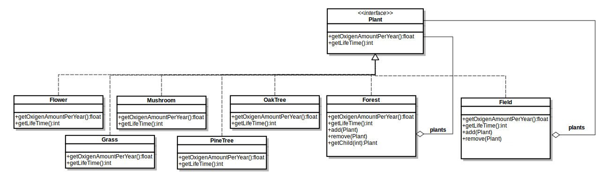

# 8. Laboratóriumi gyakorlat

Alkalmazzuk az **összetétel tervezési mintát erdők és rétek összerakására,** az *alábbi diagram* alapján.



Az ábra alapján, vannak **egyszerű** és **összetett** elemeink.
- Egyszerű elemek: **virág** (`Flower`), **gomba** (`Mushroom`), **fű** (`Grass`), **tölgyfa** (`Oak`) s **fenyő** (`Pine`).

- Összetett elemek: **erdő** (`Forest`) és a **mező** (`Field`).

Mindegyik elem a **növény** *interfészt* implementálja, **függetlenül attól, hogy egyszerű-e vagy összetett.** Az **erdő** es a **mező** **fűből,** **több fából,** **virágból** és **gombából** áll.

Az **erdő** összetett komponenst **implementaljuk** úgy, hogy a hozzá tartozó elemeket `ArrayList`-ben **tárolja**, a **mezőt** pedig úgy, hogy `HashSet`-ben. Az `add()`, `remove()`, illetve `getChild()` (**ez utóbbit csak az erdő esetében!**) metódusokat implementáljuk úgy, hogy használjuk az `ArrayList`, illetve `HashSet` **megfelelő metódusait.**

A `Plant` interfész `getOxigenAmountPerYear()` függvénye **visszatéríti az adott növény által egy év alatt termelt oxigén mennyiségét** **(literben).**
A `getLifeTime()` metódus pedig **visszatéríti a növény várható élettartamát (évben)**.
Az **összetett elemek** (**erdő** es **mező**) esetében a **termelt oxigén mennyisége** értelemszerűen **a hozzá tartozó elemek által termelt mennyiségek összege**.
Az **élettartam** pedig **a hozzá tartozó elemek élettartamának maximuma**.

Példaul, ha van egy erdőnk ami egy **fenyőből (oxigén: 100, élettartam: 15)** es egy **virágból (oxigén: 20, élettartam: 2)** áll, akkor **az erdő által termelt oxigén mennyisége 120 liter, míg a várható élettartama 15**.

**A mező esetében**, **az oxigénmennyiség és élettartam lekérdezésekor**, **a hozzátartozó elemek bejárásakor használjuk a `java.util.Iterator`-t**, pl:

``` java
        Iterator<Plant> it = plants.iterator();
```

Tesztként **hozzunk létre egy fenyőerdőt**, egy **bükkerdőt** és néhány **tisztást**. A **tisztásokat** helyezzük el az **erdőkön belül**. Ezután **írjuk ki**, hogy **az erdők mennyi oxigént termelnek és mekkora a várható élettartalmuk**.