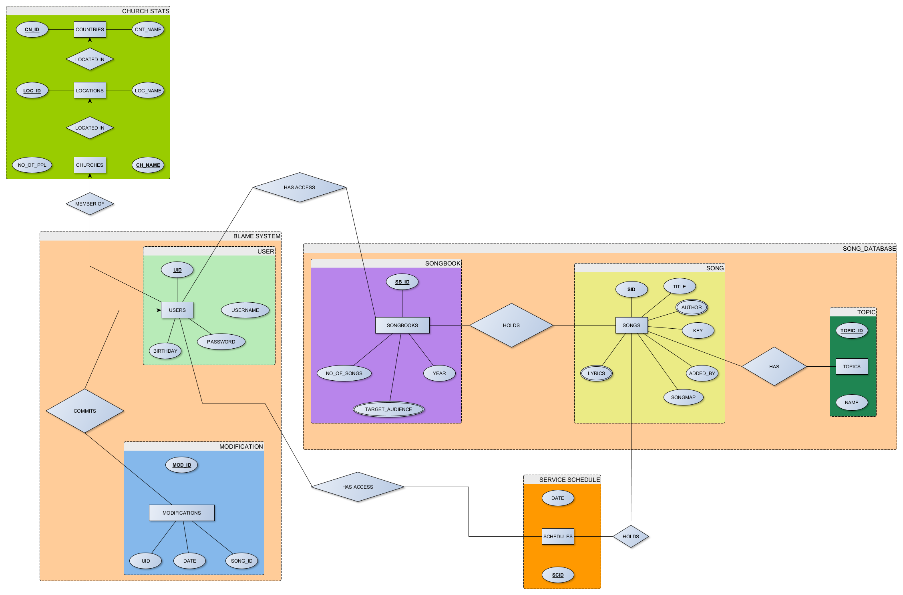

# Saját 2


```sql
USE master
GO
IF EXISTS ( SELECT * FROM sys.databases WHERE name='Church_Song' )
	DROP DATABASE Church_Song

CREATE DATABASE Church_Song
GO
USE Church_Song
GO
```

### CHURCH STATS
Countries ( **CN_ID** , CNT_NAME )

```sql
CREATE TABLE Countries (
    CN_ID INT,
    CNT_NAME VARCHAR(50),

    CONSTRAINT COUNTRY_PK PRIMARY KEY(CH_ID)
)
```

Locations ( **LOC_ID** , **CN_ID** , LOC_NAME )
Churches ( **CH_NAME** , **LOC_ID** , NO_OF_PPL )

### BLAME SYSTEM
Users ( **UID** , **CH_NAME** , Username , Password , Birthday )
Modifications ( **MOD_ID** , Date , *SONG_ID* )
Commits ( **UID** , **MOD_ID** )

### SONG DATABASE
Songbooks ( **SB_ID** , NO_OF_SONGS , Year )
Songs ( **SID** , Title , Key , **First_Added_By** , Songmap , **Lyrics** )
Topic ( **TOPIC_ID** , Name )
Author ( **Author_ID** , Name )
Has_Author ( **SID** , **Author_ID** )
Lyrics ( **Lyr_ID** , Language , *Lyr_text* )

### SERVICE SCHEDULE
Schedules ( **SC_ID** , Date )

### CONNECTIONS
Has_Acces_DB ( **UID** , **SB_ID** )
Holds_SB_S ( **SB_ID** , **SID** )
Has_Topic ( **SID** , **TOPIC_ID** )
Holds_SCH ( **SC_ID** , **SID** )
Has_Access_SCH ( **UID** , **SC_ID** )