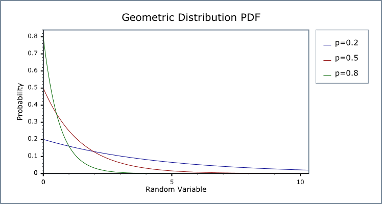

# STAT JEGYZET

[TOC]

## Distributions

### Continuous

$PDF = f_X(x)$

$CDF = F_X(x)$

$F_X(x) = \int\limits_{-\infty}^{x} f_X(t)\;dt$

$f_X(x) = \frac{d}{dx} F_X(x)$

$E (x)= \int\limits_{-\infty}^{\infty}x\;f_X(x)\;dx$

$Var(x) = \int\;(x-\int (\,x\;f_X(x)\,)\;dx\;)^2\;f_X(x)\;dx$

#### Exponential

$Exp_{\lambda}(x) =\left\{
​        \begin{array}{}
​            -\lambda e^{-\lambda x} &, \quad x \geq 0 \\
​            0 &, \quad x < 0
​        \end{array}
​    \right. \;\;,\;\lambda > 0$

$CDF_{\lambda}(x) = \left\{
​        \begin{array}{}
​            1 - e^{-\lambda x} &, \quad x \geq 0 \\
​            0 &, \quad x < 0
​        \end{array}
​    \right. $

$Var(Exp_\lambda)  = \frac{1}{\lambda^2}$

$E(Exp_\lambda) = \frac{1}{\lambda}$

#### Normal

$N_{(\mu,\sigma)}(x) = \frac{1}{\sqrt{2\pi\sigma^2}}^{-\frac{(x-\mu)^2}{2\sigma^2}}  \;,\; \mu\in\R,\sigma>0$

$CDF_{(\mu,\sigma)}(x) = \frac{1}{2}[1+{erf}(\frac{x-\mu}{\sigma\sqrt{2}})]$

${erf}(x) = \frac{2}{\sqrt{\pi}}\int\limits_{0}^{x}{e^{-t^2} dt}$

$Var(N_{(\mu,\sigma)})=\sigma ^2$

$E(N_{(\mu,\sigma)}) = \mu$

#### Gamma

$Gamma_{(a,b)}(x) =\left\{
​        \begin{array}{}
​            \frac{b^{a} x^{a-1} e^{-bx}}{\Gamma(a)} &, \quad x > 0 \\
​            0 &, \quad x \leq 0
​        \end{array}
​    \right. $

$\Gamma(a) = \int\limits_{0}^{\infty}x^{a-1} e^{-x} dx$

$CDF(Gamma_{(a,b)})(x) = \frac{1}{b^a\Gamma(a)} \int\limits_{0}^{x}t^{a-1} e^{\frac{-t}{b}} dt$

$Var(Gamma_{(a,b)}) = \frac{a}{b^2}$

$E(Gamma_{(a,b)}) = \frac{a}{b^2}$

### Discrete

${PMF} = \begin{pmatrix} \;x_1 & x_2 & \dots & x_i
\;\\ \;p_1&p_2&\dots&p_i\;\end{pmatrix}$

$PMF = f_X(x_i) = p_i$

$CDF=F_X(x)$

$F_X(x) = \sum\limits_{x_i \,\leq\, x} p(x_i)$

$E(x)=\sum xP(x)$

$p_i = p(x_i)$

$Var(x) = \sum\limits_{i=1}^{n} p_i (x_i-\mu)^2$

$\mu = \sum\limits_{i=1}^{n} p_i\;x_i$

#### Geometric

${Geo}_p(i) = (1-p)^{i-1} \;,\;p\in(0,1)$

$CDF({Geo}_p)(i) = 1 - (1-p)^{i}$

$Var({Geo}_p) = \frac{1-p}{p^2}$

$E(Geo_p)=\frac{1}{p}$

#### Poisson

$Poisson_\lambda(i) = \frac{\lambda^i e^{-\lambda}}{i!}\;,\;\lambda>0$

$$CDF(Poisson_\lambda)(i) = e^{-\lambda} \sum\limits_{i=0}^{floor(x)}\frac{\lambda^i}{i!}$$

$Var(Poisson_\lambda)=\lambda$

$E(Poisson_\lambda)=\lambda$

